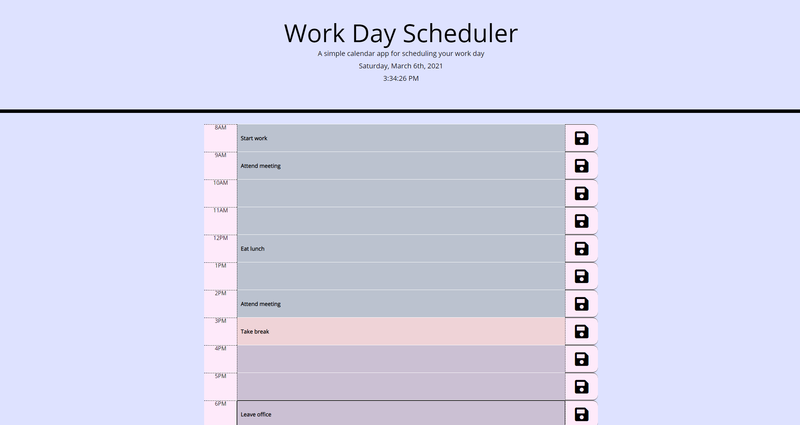

# Work Day Scheduler

## Table of Contents

* [Description](#description)
* [Usage](#usage)
* [Credits](#credits)
* [License](#license)

## Description

Are your days at the office hectic? Do you need a better way to plan your day? 

This work day scheduler allows you to see the current time and date so you can enter in your plans for the day. Just click on the box related to the time you'd like to schedule for, type in your plans, and hit the save icon. Your schedule will be saved until you'd like to make changes. 

You're guaranteed to feel more in control of your day with this helpful planner! 

This scheduler is written in jQuery, HTML, Bootstrap, and MomentJS.

## Usage

Navigate to [Soma Makela's Work Day Scheduler](https://smakela13.github.io/work-day-calendar/index.html) and view the web page.

## Credits

Created by [Soma Makela](https://github.com/smakela13).

## License

This website currently has No License, which means it is under exclusive copyright. No one can copy, distribute, or modify this website without permission.